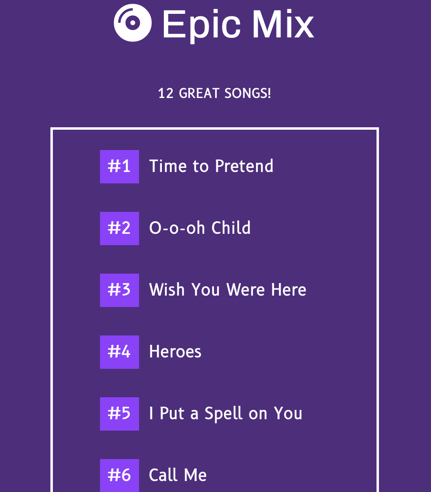

<h1>Epic Song Mix</h1>

<h2>Program</h2>

The epic song list will display in numbered order after the Show Me button is clicked.

<h4>JavaScript Toolbox:</h4>

* various functions
* forEach
* let, append
* classList
* innerHTML
* console logging 
* template literals

Program uses functions, a loop, strings, and a class to create an auto-generated list of the songs and their indexes.

